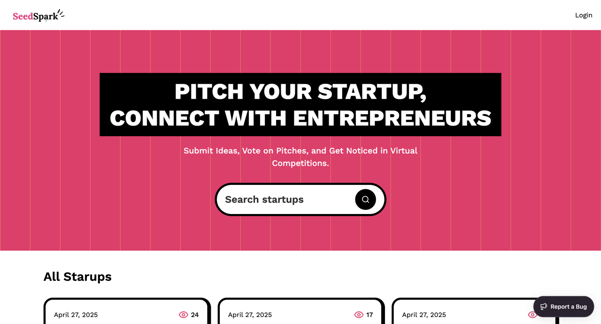

# 💡 SeedSpark



**SeedSpark is a platform designed to allow startups to pitch their ideas, providing them with an online space to present their startup concept, engage with potential investors, and get feedback. The application streamlines the process of showcasing startup ideas through an easy-to-use web interface built using Next.js, Sanity CMS, and Tailwind CSS. Entrepreneurs can submit their startup pitches, and interested parties can explore the ideas and offer feedback, fostering collaboration and support.**

## 🚀 Features

- **Startup Pitch Submission**: Entrepreneurs can submit their startup ideas and showcase them to a wider audience.
- **Feedback and Engagement**: Users can leave feedback and engage with the ideas presented.
- **Content Management**: Admins can manage the content through Sanity CMS.
- **Responsive Design**: The platform is built using Tailwind CSS, ensuring a responsive, mobile-friendly experience.
- **Error Monitoring**: Sentry integration helps track and fix issues in real-time.
  
## 🌐 Live Demo

Check out the live demo of **SeedSpark**:  
[Live Demo](https://seed-spark.vercel.app/)  

## 🛠️ Getting Started

### Prerequisites

- **Node.js** (v14 or higher)
- **npm** or **yarn**
- **Sanity CLI** (for CMS setup)

### Installation

1. **Clone the repository:**

   ```bash
   git clone https://github.com/AbhiK1237/SeedSpark.git
   cd SeedSpark
   npm insatll

Set up environment variables:

Create a .env.local file in the root directory and add the necessary environment variables.
- AUTH_SECRET=
- AUTH_GITHUB_ID=
- AUTH_GITHUB_SECRET=
- NEXT_PUBLIC_SANITY_PROJECT_ID=
- NEXT_PUBLIC_SANITY_DATASET=
- NEXT_PUBLIC_SANITY_API_VERSION=
- SANITY_WRITE_TOKEN=

Create a .env.sentry-build-plugin file, and add
- SENTRY_AUTH_TOKEN=

Run the development server:
- npm run dev

🧰 Technologies Used

- Next.js

- Sanity CMS

- Tailwind CSS

- TypeScript

- Sentry


🤝 Contributing
Contributions are welcome! Please open an issue or submit a pull request for any improvements or bug fixes.

📫 Contact
For any inquiries or feedback, please contact AbhiK1237.


